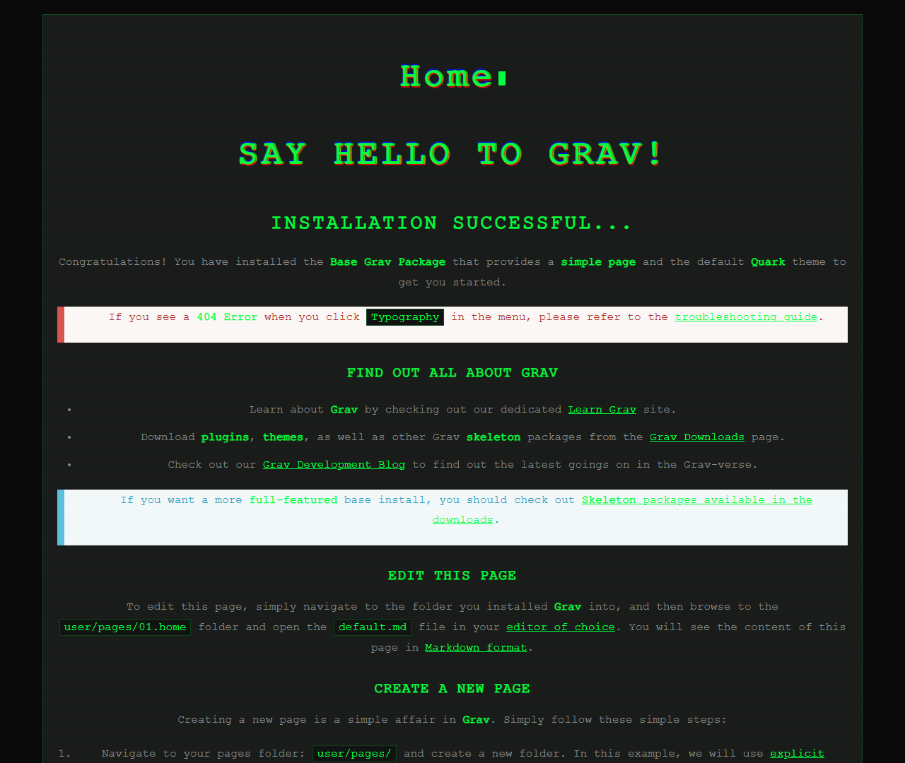
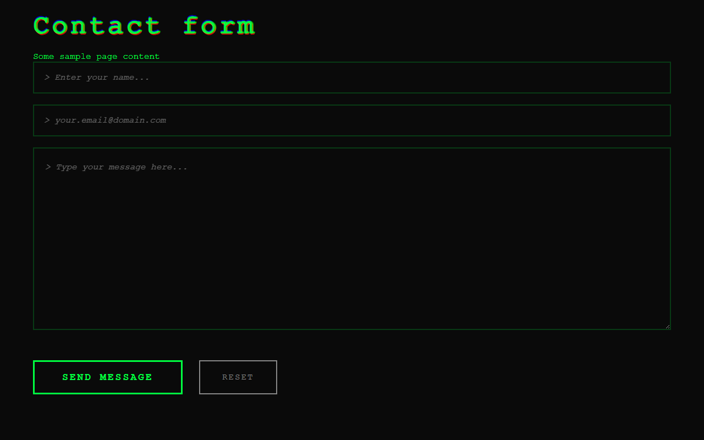

# Anonymous - Cyberpunk Theme for Grav CMS






A cyberpunk-style theme for Grav CMS with matrix rain effects, terminal aesthetics, and hacker-inspired design.

[日本語版README](README_ja.md)

## Features

- 🌐 **Cyberpunk Aesthetic**: Matrix rain effects, glitch animations, and terminal-style design
- 📱 **Fully Responsive**: Works seamlessly on all devices
- ⚡ **Lightweight**: Minimal dependencies, fast loading
- 🎨 **Customizable**: Easy theme configuration via YAML
- 🔒 **Privacy-Focused**: No tracking, no external dependencies (except optional Twemoji)
- 💚 **Green Terminal Theme**: Classic hacker aesthetic with neon green accents

## Installation

### Method 1: ZIP Installation (Recommended)

1. Download the latest release as a ZIP file
2. In Grav admin panel, go to `Themes` → `Add`
3. Upload the ZIP file
4. Activate the theme

### Method 2: Manual Installation

1. Download or clone this repository
2. Extract the files to your Grav `user/themes/` folder
3. Rename the folder to `anonymous`
4. Activate the theme in Grav admin panel

## Configuration

Edit `user/config/themes/anonymous.yaml`:

```yaml
enabled: true

site:
  name: 'Your Site Name'
  tagline: 'Your Tagline'
  url: 'https://yoursite.com'
  
social:
  twitter: '@YourTwitterHandle'

theme:
  matrix_effect: true
  glitch_effect: true
```

## Contact Form Template

The `contact-form-sample` folder contains a ready-to-use contact form template that you can copy and paste into your Grav pages. This template is designed to work seamlessly with Grav's Form plugin and includes:

- Pre-styled hacker/cyberpunk aesthetic form fields
- Email validation
- reCAPTCHA support
- Responsive design

**To use it:**
1. Make sure the Grav **Form plugin** is installed and enabled
2. Copy the contents of `contact-form-sample/form.md`
3. Create a new page in your Grav site (e.g., `pages/contact/form.md`)
4. Paste the content and customize as needed (email addresses, reCAPTCHA keys, etc.)

## Customization

### CSS Variables

Edit `css/style.css` to customize colors:

```css
:root {
    --primary-green: #00ff41;
    --bg-black: #0a0a0a;
    /* ... more variables */
}
```

## Requirements

- Grav CMS 1.7+
- PHP 7.4+

## Credits

**Author**: Kusai Mara  
**GitHub**: [@Kusaimara](https://github.com/Kusaimara)  
**X(Twitter)**: [@Kusai_Mara](https://x.com/Kusai_Mara)

## License

MIT License - see [LICENSE](LICENSE) file for details

Made with 💚 and terminal love