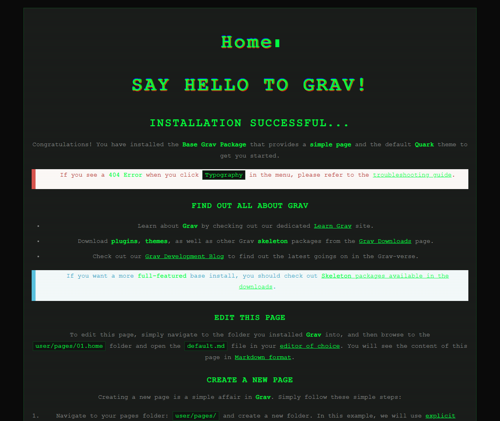
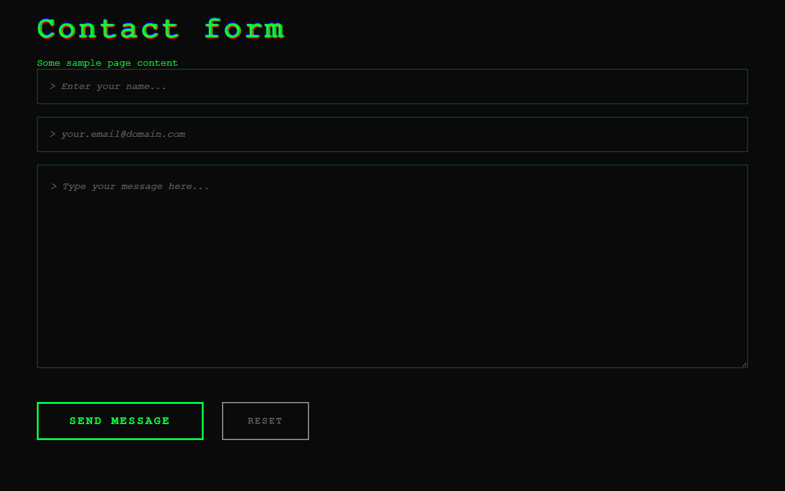

# Anonymous - Grav CMS用サイバーパンクテーマ






Grav CMS用のサイバーパンクスタイルテーマ。マトリックス風の雨エフェクト、ターミナル風デザイン、ハッカー風の見た目が特徴です。

[English README](README.md)

## 特徴

- 🌐 **サイバーパンク美学**: マトリックスの雨エフェクト、グリッチアニメーション、ターミナル風デザイン
- 📱 **完全レスポンシブ**: すべてのデバイスでシームレスに動作
- ⚡ **軽量**: 依存関係が少なく、高速読み込み
- 🎨 **カスタマイズ可能**: YAMLファイルで簡単にテーマ設定
- 🔒 **プライバシー重視**: トラッキングなし、外部依存なし
- 💚 **グリーンターミナルテーマ**: ネオングリーンアクセントを使った古典的なハッカー美学

## インストール

### 方法1: ZIPインストール（推奨）

1. 最新リリースをZIPファイルとしてダウンロード
2. Grav管理画面で `テーマ` → `追加` に移動
3. ZIPファイルをアップロード
4. テーマを有効化

### 方法2: 手動インストール

1. このリポジトリをダウンロードまたはクローン
2. ファイルをGravの `user/themes/` フォルダに展開
3. フォルダ名を `anonymous` に変更
4. Grav管理画面でテーマを有効化

## 設定

`user/config/themes/anonymous.yaml` を編集:

```yaml
enabled: true

site:
  name: 'あなたのサイト名'
  tagline: 'あなたのキャッチフレーズ'
  url: 'https://yoursite.com'
  
social:
  twitter: '@YourTwitterHandle'

theme:
  matrix_effect: true
  glitch_effect: true
```

## カスタマイズ

### CSS変数

`css/style.css` を編集して色をカスタマイズ:

```css
:root {
    --primary-green: #00ff41;
    --bg-black: #0a0a0a;
    /* ... その他の変数 */
}
```

## 動作環境

- Grav CMS 1.7以上
- PHP 7.4以上

## クレジット

**作者**: Kusai Mara  
**GitHub**: [@Kusaimara](https://github.com/Kusaimara)
**X(Twitter)**: [@Kusai_Mara](https://x.com/Kusai_Mara)

## ライセンス

MITライセンス - 詳細は[LICENSE](LICENSE)ファイルを参照

💚とターミナル愛で作られました
